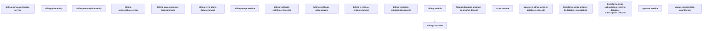

# AST Cluster Analysis Report

Analysis Date: 2025-03-27 00:06:52

## Summary

Total Clusters Analyzed: 1

### Category Distribution

- API Controllers: 1

## Detailed Analysis

### Cluster 1 (API Controllers)

Files: 20

Sample Files:
- billing-portal.workspace-service.ast.json
- billing-price.entity.ast.json
- billing-subscription.entity.ast.json
- billing-subscription.service.ast.json
- billing-sync-customer-data.command.ast.json

#### Service Relationship Diagram

#### Analysis

</think>

Okay, let's tackle this step by step. First, I need to understand the cluster of files provided. The cluster ID is 1, categorized under API Controllers with 20 files. The files seem to relate to billing, subscriptions, webhooks, and Stripe integration. 

Starting with the summarized AST representation. The common elements across the files are ImportDeclarations and ExportNamedDeclarations. The main modules imported are @nestjs/common, stripe, typeorm, and @nestjs/typeorm. Exports are mostly ClassDeclarations, which makes sense for NestJS modules, services, and entities. The entities like billing-price.entity and billing-subscription.entity suggest TypeORM is used for ORM, which ties into data persistence.

Next, data sink services. The presence of typeorm and entities indicates a relational database is a primary data sink. Also, Stripe is heavily imported, so their API is another data sink for handling payments, subscriptions, etc. Webhook services (like billing-webhook-subscription.service) might be sending or receiving data to/from external systems, so external APIs are involved here.

For data persistence technologies, TypeORM is clearly used, which typically interfaces with databases like PostgreSQL, MySQL, or SQLite. Given the context, PostgreSQL is a common choice with NestJS and TypeORM, but the exact DB isn't specified. However, the Stripe module is used for external data interactions.

Types of data processed would include billing-related entities: subscriptions, prices, products, customer data, usage metrics. The entities have enums for billing schemes, tax behaviors, intervals (monthly/yearly), which points to handling different subscription models and pricing tiers.

Data flow patterns: The services like billing-sync-customer-data.command and billing-sync-plans-data.command suggest synchronization between the application's database and Stripe. Webhook services likely listen to Stripe events (e.g., subscription updates) and update internal entities accordingly. The transform utilities (e.g., transform-stripe-product-to-database-product.util) indicate data transformation from Stripe's API format to the application's database schema.

Interactions with external systems are primarily through Stripe's API for payment processing, subscription management, and webhooks. The Stripe module and webhook services handle these interactions, receiving events and updating internal state or triggering actions like syncing data.

Looking at the service relationships, the billing.module is central, linking to the billing.controller. Controllers in NestJS handle HTTP requests, so the billing.controller probably exposes API endpoints for frontend or external systems. Services like billing-subscription.service and billing-usage.service handle business logic, interacting with the database via TypeORM and communicating with Stripe. The Stripe-related services (e.g., StripeCheckoutService) manage direct API calls to Stripe, while webhook services process incoming events from Stripe to update subscriptions or prices in the database.

Putting this all together, the main data sinks are the relational database (via TypeORM) and Stripe's API. Data flows involve syncing between Stripe and the DB, processing webhooks to update entities, and transforming data formats between external and internal models. The interaction between NestJS modules, services, and controllers facilitates this flow, ensuring data consistency and handling billing operations.

---

## Conclusion

This report provides an analysis of AST clusters, identifying common patterns, data sinks, and data flow within each cluster.
